# 🧪 LLM Evaluation Harness

An open-source **GenAI testing framework** to evaluate and benchmark large language models (LLMs) such as **Llama-3**, **Mistral**, and **Phi-3**.  
It measures **accuracy**, **factuality**, **hallucination**, and **bias** using entirely **free and local tools**.

---

## 🎯 Overview

Modern Generative AI systems are powerful but unpredictable.  
This project aims to make **LLM evaluation reproducible**, **transparent**, and **test-driven** — combining traditional QA principles with GenAI-specific metrics.

The harness will allow you to:
- Run the same prompt set across multiple LLMs (local or remote)
- Evaluate model outputs for quality, coherence, and bias
- Generate visual dashboards and shareable reports
- Extend easily for observability, cloud, or CI/CD integration

---

## 🧠 Key Features *(planned & evolving)*

| Category | Description |
|-----------|-------------|
| **Model Adapters** | Unified interface for Ollama, Hugging Face, and other local LLMs |
| **Evaluation Engine** | Integrates DeepEval, Ragas, and custom metrics |
| **Dashboard** | Streamlit UI to visualize scores and compare models |
| **Storage Layer** | JSON / CSV results (extensible to SQLite or DynamoDB) |
| **Observability (coming soon)** | OpenTelemetry + Grafana dashboards |
| **Cloud Extensions (coming soon)** | AWS Lambda, S3, and Render free-tier deployment |

---

## ⚙️ Setup

```bash
# Clone repository
git clone https://github.com/<yourusername>/llm-eval-harness.git
cd llm-eval-harness

# Create virtual environment
python3 -m venv venv
source venv/bin/activate   # or .\venv\Scripts\activate on Windows

# Install dependencies using uv
uv pip install -r requirements.txt
```
---

## Project Structure
```bash
llm-eval-harness/
├── app/         # Streamlit or FastAPI dashboard
├── models/      # Model adapters (Ollama, Hugging Face)
├── eval/        # Evaluation logic and metrics
├── data/        # Prompt datasets
├── reports/     # Generated evaluation results
├── requirements.txt
└── README.md
```

---

## 🧰 Tech Stack

| Layer                          | Tools / Technologies                                      | Purpose                                                                       |
| ------------------------------ | --------------------------------------------------------- | ----------------------------------------------------------------------------- |
| **Language**                   | **Python 3.10+**                                          | Core programming and orchestration language                                   |
| **Dependency Management**      | **uv**                                                    | Fast, reproducible Python environment and package installs                    |
| **Frameworks**                 | **FastAPI**, **Streamlit**                                | REST API backend and interactive evaluation dashboard                         |
| **LLM Runtime**                | **Ollama**, **Hugging Face Transformers**                 | Run local or hosted LLMs (Llama-3, Mistral, Phi-3, etc.)                      |
| **Evaluation Frameworks**      | **DeepEval**, **Ragas**, **sentence-transformers**        | Compute semantic similarity, factuality, hallucination, and coherence metrics |
| **Data & Storage**             | **CSV / JSON (Phase 1)**, **SQLite / DynamoDB (Phase 2)** | Persist prompt sets and evaluation results                                    |
| **Testing Framework**          | **pytest**                                                | Unit and integration tests for evaluators and adapters                        |
| **Observability (Phase 2)**    | **OpenTelemetry**, **Grafana Cloud (free)**               | Metrics, traces, and dashboards for model performance                         |
| **Cloud Extensions (Phase 2)** | **AWS Lambda**, **S3**, **Render**                        | Optional free-tier deployment and report storage                              |
| **Version Control**            | **Git + GitHub**                                          | Code management and collaboration                                             |

---

## System Overview

